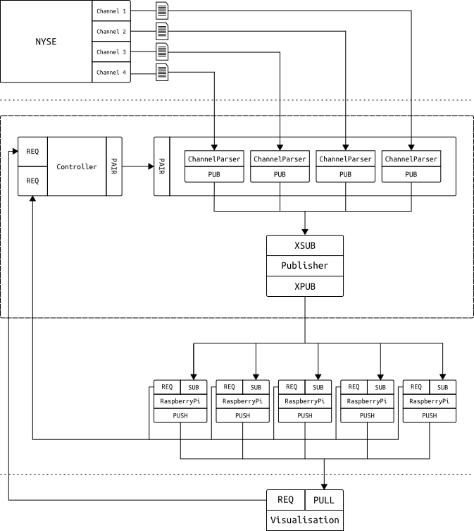
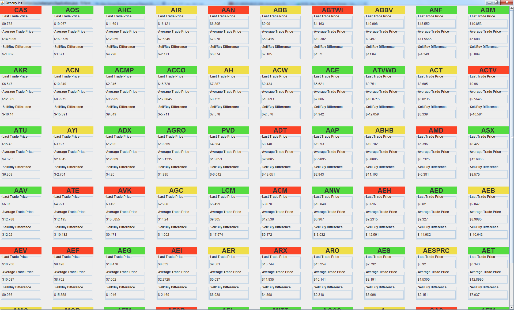

Group report
============

The following technologies have been used:

* `Python <http://python.org>`_ as the main programming language.

* `Java <http://www.oracle.com/technetwork/java/index.html>`_ for the
  visualisation.

* `Github <https://github.com/>`_ for revision control and source code
  management.

* `ØMQ <http://www.zeromq.org/>`_ for the networking.

* `Protocol Buffers <https://developers.google.com/protocol-buffers/>`_
  for network data serialization.

* Custom image of `Raspbian <http://www.raspberrypi.org/downloads>`_ as
  the Operating System for RaspberryPis.

* `Sphinx <http://sphinx-doc.org/>`_ for documentation generation.

Statistics
----------

* About 65% of Python code has been covered with unit tests.

* 81 files have been added, with total 7317 lines inserted.

Implementation
--------------

Network
^^^^^^^

`ØMQ <http://www.zeromq.org/>`_ and all 4 built-in core messaging
patterns have been used for the networking:

* **Request-reply** for synchronization between:

  * visualisation and the initializer

  * RaspberryPis and the initializer (synchronized publisher).

* **Pub-sub** for distribution of the stock data to RaspberryPis.

* **Pipeline** for collection of proccessed data from RaspberryPis.

* **Exclusive pair** for synchronizing threads in the Controller.

`Protocol Buffers <https://developers.google.com/protocol-buffers/>`_
have been used to serialize data.  They are easy and allow to define
messages and serialize it easily and cross language barriers. They
generate source files in the given language. This means an interface
consistent with the language and with type safety.

The system outline
""""""""""""""""""

#. Controller starts and spawns 3 different threads: the
   :py:class:`network initializer
   <oxberrypis.net.controller.init.InitializerThread>`,
   :py:class:`channels publishers master thread
   <oxberrypis.net.controller.publisher.ChannelPublishersThread>` and
   :py:class:`publisher-subscriber proxy thread
   <oxberrypis.net.controller.publisher.ProxyThread>`.

#. The initializer parses stock's symbol indexes to symbol names and
   price scale code (power of denominator) mapping and splits this
   mapping into several ranges. Number of ranges is determined from the
   number of RaspberryPis which publisher expects to connect.

#. The initializer waits for visualisation to issue a synchronization
   request on the ``REQ`` socket and replies on the ``REP`` socket with
   ranges of symbol indexes. Visualisation uses this data to display
   symbol names instead of symbol indexes and also to order data sent
   from RaspberryPis.

#. The initializer starts :py:class:`synchronized publisher
   <oxberrypis.net.components.SynchronizedPublisher>` which waits for
   expected number of RaspberryPis to connect. Dummy data (ping) is
   published to the network through the proxy.

#. When RaspberryPi is turned on it starts to listen on the ``SUB``
   socket and once data arrives it sends symbol range request on the
   ``REQ`` socket. The initializer replies on the ``REP`` socket.  Each
   RaspberryPi is assigned two different ranges to allow high
   availability of the entire system (ranges overlap between
   RaspberryPis). RaspberryPi subscribes to given range.

#. Once all RaspberryPis are connected, synchronized publisher dies and
   the initializer hands over to the master synchronized publishers
   thread over the ``PAIR`` socket.

#. Master synchronized publisher thread spawns 4 threads, one for each
   channel from NYSE. Each thread parses the channel file and publishes
   the data through the proxy. Data is encapsulated in special envelopes
   containing stock index and channel id to allow:

   * subscriber prefix matching on RaspberryPis

   * easier ordering in the visualisation

#. RaspberryPis process the data in their order books and send the
   results over the ``PUSH`` socket.

#. Visualisation listens for stock event messages incoming on the
   ``PULL`` socket and updates its UI respectively.

Note that this design allows scaling of both:

* number of channel parsers in case channels number increases/decreases.

* number of RaspberryPis.

Parsing
^^^^^^^

`NYSE Arca Integrated Feed <http://www.nyxdata.com/page/1084>`_ is split
into 4 different channels. Sample data can be downloaded from the FTP
and it comes in 4 different files, one for each stream.

Each channel is a stream of packets containing variable number of
messages of different type. Each packet starts with a :py:class:`packet
header <oxberrypis.parsing.headers.PacketHeader>` which contains e.g.
the packet time and the number of messages contained  and each message
starts with a :py:class:`message header
<oxberrypis.parsing.headers.MsgHeader>` which contains the message type
and its size. Parser runs on a single channel file, unpacking the
headers and and parsing only relevant messages based on their type found
in the header.  Since `Order Book`_ needs only select message types,
filtering is important for performance reasons: firstly not all of the
messages are parsed and secondly less data is transmitted over the
network.

:py:mod:`Parsing module <oxberrypis.parsing>` uses special framework
built for this project only which allows easy extension of the code,
e.g. by adding new :py:mod:`messages <oxberrypis.parsing.messages>` or
new :py:mod:`message fields <oxberrypis.parsing.fields>`.

Order Book
^^^^^^^^^^

The :py:mod:`order book <oxberrypis.orderbook>` is the main processing
code that runs on Raspberry Pis.  The order book module consists of two
books classes, one for demand and one for supply. :py:class:`The book
<oxberrypis.orderbook.book.OrderBook>` keeps all the orders and allows
changing them as well as querying for orders either by id or for the
currently best order. Order book keeps a set of limit books for each
limit price that is present. This seems natural since there will be lots
of orders for a single price and some update orders can move order to
the end of queue for the price. Each limit book the keeps orders at this
price in first come first serve basis.

The whole book class is very modular and it can be connected with any
collection for limit books as well as for structures. We chose to pick
:py:mod:`Finacci heap <oxberrypis.orderbook.fibonacci_heap>` to store
limit prices and :py:mod:`Doubly linked list
<oxberrypis.orderbook.linked_list>` for individual orders for a single
limit price. For limit prices we need to very efficiently add element
and query for smallest element, also reasonably fast remove any element.
Fibonacci heap allows the first two in O(1) and the second two in O(log
N). For orders at a single limit price, the operations are the same,
except we only add elements at the beginning or the end, doubly linked
lists are perfect for this allowing all operations in O(1).

The :py:class:`matching engine class
<oxberrypis.orderbook.matching_engine.MatchingEngine>` is the class that
implements trading logic. It implements the rules of which order has a
priority, in which cases changing the order loses its position in queue,
what will be the price when there is larger interval of agreement.
Matching engine is also a public interface for other modules to use.

Visualisation
^^^^^^^^^^^^^

The visualisation section was implemented in Java, meaning that we made
use of the `Protocol Buffers
<https://developers.google.com/protocol-buffers/>`_ to switch from the
Python code to the Java. The only one that was used for visualisation
was ``StockEvent``, which provided a stock id, information on what
channel it came from, sequence number which allowed to detect duplicates
(produced due to the high availability model we used), along with
optionally the last trade price, top buy price and top sell price.

A stock was given its own class, containing the stock name, last trade
price, top buy price and top sell price. The stock name was obtained
from a map sent from the parser, taking stock id to stock name. Each
time a ``StockEvent`` came through, if the stock was already in the map,
it was updated, otherwise it was added to the map.

The actual visual part of the project was written using Java Swing. A
scrollable grid of each stock is shown, along with its last trade price,
the average of its top buy and top sell prices, and the difference
between the top buy and top sell prices. Each time a new trade price
comes in, it is compared with the previous one and the cell of the stock
changes colour depending on if the price went up, down or stayed the
same.
